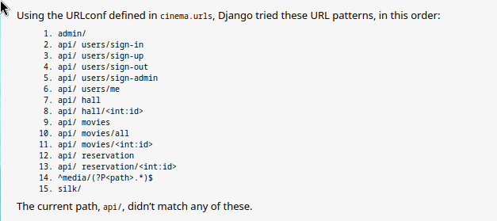

# Cinema Reservation

a simple cinema reservation app that depends on django and django-rest-framework using default token auth for drf



## Features

- [Halls](#hall-section)
- [Movies](#movie-section)
- [Reservations](#movie-section)
- [Users](#User-section)

## Installaion

<h6 style="color:green">Ensure you have pipenv installed locally then catch up</h6>

```
git clone https://github.com/Yossef-Elshafey/tickets-api
```

```
cd tickets-api
```

```
pipenv install --dev
```

- virtual environment using pipenv with required packeges

```
pipenv shell
```

- for venv activation

#### Migrations

```
python manage.py makemigrations hall movies reservation users
```

```
python manage.py migrate
```

at this point you should run server without any errors

```
python manage.py runserver
```
